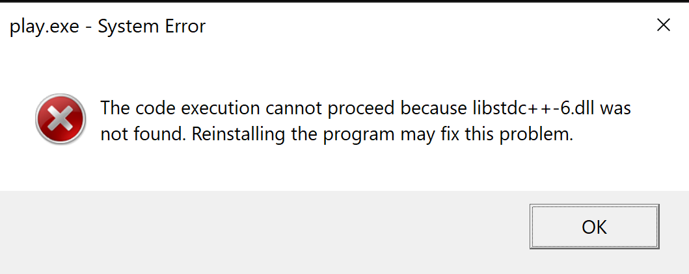

# Primary Source Tree
---------------------
This is the primary source code for the project.

## Building and Running
-----------------------

### Pre-requisites (Windows only)
Tested on Windows env:
```
OS Name:    Microsoft Windows 10 Home
OS Version: 10.0.18363 N/A Build 18363
```
1. Install [MSYS2](https://www.msys2.org/).
1. Once MSYS2 is installed, open a `mingw64` terminal:  
`> C:\msys64\mingw64.exe`  
_NOTE: Make sure you are running mingw 64-bit.  When in 32-bit, the installations complete just fine, but the recently-installed commands like `cmake` and `gcc` aren't found._
1. Install the following using `pacman`:
    * CMake: `$ pacman -S mingw64/mingw-w64-x86_64-cmake`
        * Ver: 3.17.3 (all version are as-installed when I wrote this)
    * GCC Compiler toolchain: `$ pacman -S mingw64/mingw-w64-x86_64-toolchain`  
        * Ver: gcc.exe (Rev1, Built by MSYS2 project) 10.2.0
        * NOTE: C/C++/FORTRAN compilers all included.
    * Ninja: `$ pacman -S mingw64/mingw-w64-x86_64-ninja`
        * Ver: 1.10.1
    * Python:
        ```
        $ pacman -S mingw64/mingw-w64-x86_64-python3
        $ pacman -S mingw64/mingw-w64-x86_64-python3-pip
        $ python3 -m pip install pipenv
        ```  
        Versions:
        * Python 3.8.5
        * pip 20.0.2 from C:/msys64/mingw64/lib/python3.8/site-packages/pip (python 3.8) 
        * pipenv, version 2020.11.4

1.  Use `pipenv` to created an isolated build environment:  
Useful commands:
    * `pipenv shell` to enter pipenv.
    * `exit` to exit pipenv.
    * `pipenv run` to run a commend in environment.

Do this:
`$ pip install --user pip pipenv --upgrade`  
NOTE: This may happen for the `--upgrade` step:  
```
WARNING: The scripts pip.exe, pip3.8.exe and pip3.exe are installed in 'C:\Users\<user>/.local/bin' which is not on PATH.
Consider adding this directory to PATH or, if you prefer to suppress this warning, use --no-warn-script-location. 
```
<div style="color:red">ERROR: Getting the following result for this:</div>

`$ pipenv install --python python3.5`
```
Warning: Python python3.5 was not found on your system...
Neither 'pyenv' nor 'asdf' could be found to install Python.
You can specify specific versions of Python with:
$ pipenv --python path/to/python
(SoundBox-R8wHh5Fp)
```
<div style="color:red">SKIPPING...  </div>

See [other stuff](#other-stuff) I added for personal preference, but not required.

### To Build

### Building with Ninja:
Starting fresh (removing `_build` dir from above):
```
$ cmake -G Ninja ..
-- The CXX compiler identification is GNU 10.2.0
-- Check for working CXX compiler: C:/msys64/mingw64/bin/c++.exe
-- Check for working CXX compiler: C:/msys64/mingw64/bin/c++.exe - works
-- Detecting CXX compiler ABI info
-- Detecting CXX compiler ABI info - done
-- Detecting CXX compile features
-- Detecting CXX compile features - done
-- Configuring done
-- Generating done
-- Build files have been written to: D:/repos/SoundBox/source/_build
```

Build:
```
$ cmake --build .
[1/2] Building CXX object CMakeFiles/play.dir/play.cpp.obj
[2/2] Linking CXX executable play.exe

```

### To Run
From `SoundBox/source/_build`, run `$ ./Debug/play.exe`
<div style="color:red">ERROR: this results in</div>



### Broken builds

#### Building with mingw GCC
1. From [SoundBox/source](../source):
    `> mkdir _build`
    `> cd _build`
    `> cmake ..`

    (TODO: change for mingw)  
    Expected output:
    ```
    $ cmake ..
    -- Selecting Windows SDK version 10.0.18362.0 to target Windows 10.0.18363.
    -- The CXX compiler identification is MSVC 19.27.29111.0
    -- Check for working CXX compiler: C:/Program Files (x86)/Microsoft Visual Studio/2019/Community/VC/Tools/MSVC/14.27.29110/bin/Hostx64/x64/cl.exe
    -- Check for working CXX compiler: C:/Program Files (x86)/Microsoft Visual Studio/2019/Community/VC/Tools/MSVC/14.27.29110/bin/Hostx64/x64/cl.exe - works
    -- Detecting CXX compiler ABI info
    -- Detecting CXX compiler ABI info - done
    -- Detecting CXX compile features
    -- Detecting CXX compile features - done
    -- Configuring done
    -- Generating done
    -- Build files have been written to: D:/repos/SoundBox/source/_build
    ```

    <div style="color:red">ERRORD: Realized output:</div>

    ```
    $ cmake ..
    -- Building for: Visual Studio 16 2019
    -- Selecting Windows SDK version 10.0.18362.0 to target Windows 10.0.18363.
    -- The CXX compiler identification is MSVC 19.27.29111.0
    -- Check for working CXX compiler: C:/Program Files (x86)/Microsoft Visual Studio/2019/Community/VC/Tools/MSVC/14.27.29110/bin/Hostx64/x64/cl.exe
    -- Check for working CXX compiler: C:/Program Files (x86)/Microsoft Visual Studio/2019/Community/VC/Tools/MSVC/14.27.29110/bin/Hostx64/x64/cl.exe - works
    -- Detecting CXX compiler ABI info
    -- Detecting CXX compiler ABI info - done
    -- Detecting CXX compile features
    -- Detecting CXX compile features - done
    -- Configuring done
    -- Generating done
    -- Build files have been written to: D:/repos/SoundBox/source/_build
    ```
    <div style="color:red">Moving on...</div>
    
1. Compile  
    Expected:  
    ```
    $ cmake --build .

    Scanning dependencies of target hello-world
    [ 50%] Building CXX object CMakeFiles/hello-world.dir/hello-world.cpp.o
    [100%] Linking CXX executable hello-world
    [100%] Built target hello-world
    ```

    <div style="color:red">ERRORD: Realized output:</div>

    ```
    $ cmake ..
    Microsoft (R) Build Engine version 16.7.0+b89cb5fde for .NET Framework
    Copyright (C) Microsoft Corporation. All rights reserved.

      Checking Build System
      Building Custom Rule D:/repos/SoundBox/source/CMakeLists.txt
      play.cpp
      play.vcxproj -> "D:\repos\SoundBox\source\_build\Debug\play.exe
      Building Custom Rule D:/repos/SoundBox/source/CMakeLists.txt
    ```
    <div style="color:red">Moving on...</div>


## Other Stuff
--------------
To satisfy my personal preferences:

### Extras:
* Installing Git is a given, but I reinstalled with `pacman` since this installation of mingw64 didn't automatically find git.  Even though git bash in windows is mingw...?  
* NOTE: this could be that I was in mingw32, instead of 64... anyway, I did  
`$ pacman -S git`  
This ended up installing all of these:
```
expat-2.2.9-1  heimdal-7.7.0-2  openssh-8.3p1-1  perl-Authen-SASL-2.16-2  perl-Clone-0.45-1  perl-Convert-BinHex-1.125-1  perl-Encode-Locale-1.05-1  perl-Error-0.17029-1
perl-File-Listing-6.04-2  perl-HTML-Parser-3.72-6  perl-HTML-Tagset-3.20-2  perl-HTTP-Cookies-6.08-1  perl-HTTP-Daemon-6.12-1  perl-HTTP-Date-6.05-1  perl-HTTP-Message-6.25-2
perl-HTTP-Negotiate-6.01-2  perl-IO-HTML-1.001-1  perl-IO-Socket-SSL-2.068-1  perl-IO-Stringy-2.113-1  perl-LWP-MediaTypes-6.04-1  perl-MIME-tools-5.509-1
perl-MailTools-2.21-1  perl-Net-HTTP-6.19-1  perl-Net-SMTP-SSL-1.04-1  perl-Net-SSLeay-1.89_01-2  perl-TermReadKey-2.38-2  perl-TimeDate-2.33-1  perl-Try-Tiny-0.30-1
perl-URI-1.76-1  perl-WWW-RobotRules-6.02-2  perl-libwww-6.46-1  vim-8.2.1522-2  git-2.27.0-1
```

* To have git ignore the CLRF nonsense in Windows, after installing mingw:  
`git config --local core.autocrlf true`  
Also, I set this global at first, so to undo a global setting:  
`git config --global --unset <setting>`

* I added my working directory to ~/.bashrc, since I assumed mingw was a bash env.

## License
----------
This work is licensed under the terms of the MIT license.
For a copy, see <https://opensource.org/licenses/MIT>.